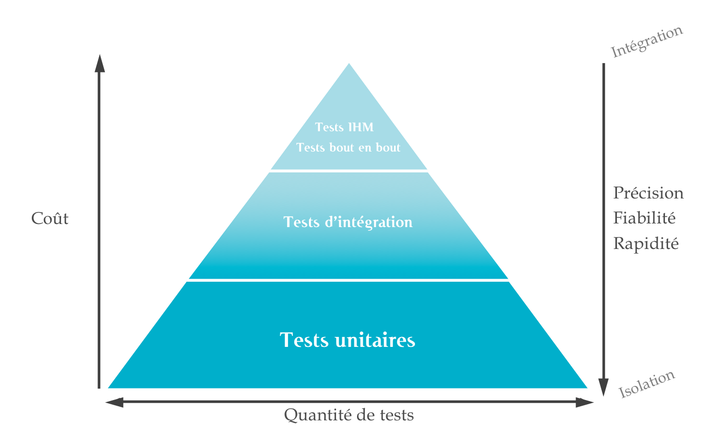

#  Reponses aux questions générales

### Pourquoi tester lorsque l'on fait du développement ?

- S'assurer que l'application fonctionne
- Appliquer une première couche de tests (pyramide)
- Tester pendant le développement peut permettre de penser le code en fonction du test, ce qui est plus simple
- Faire en sorte qu'un changement ou une mise à jour du code n'affecte pas certaines fonctionnalités

### Quels sont les différents types de tests en développement?

-  Tests unitaires : Généralement codés par les développeurs eux-mêmes. Ce sont les plus faciles à mettre en place et les plus rapides. Ils testent directement des méthodes ou des petites fonctionnalités. Ces tests sont dits "boite blanche" parce qu'ils nécessitent de connaître le code pour les mettre en place
- Tests fonctionnels : Survient après les tests unitaires, c'est un test dit "boite noire". Pas besoin de connaître le code en détail. Il est appliqué automatiquement et permet de vérifier le bon fonctionnement d'une application. 
- Tests d'intégration : Survient après les tests unitaires, il a pour but de détecter les erreurs qui n'ont pas pu être repérées en test unitaire.
- Tests de Régression : Intervient pour vérifier que l'application fonctionne aussi bien qu'avant après une modification.
- Tests de performance : On mesure davantage les temps de réponse d'une application

### Qu’est ce que la pyramide des tests ?

La pyramide des tests correspond à la chronologie et à la quantité de tests à mettre en place dans le développement d'une application. 
Les test unitaires doivent être nombreux et permettre une base solide de tests. Les tests de bout en bout doivent être moins fréquents car ils prennent plus de temps, sont moins fiables et plus couteux.

### Que sont l’intégration continue et le déploiement continu ?

-  Intégration continue : L'intégration continue est une méthode de développement ou des modifications vont être apportées constamment. C'est dans ce cadre qu'il est important d'avoir des tests automatisés pour mieux repérer les bogues.

-  Intégration fonctionnelle :

#  Exercice de test

2. Choix du site https://www.saucedemo.com.
3. Tests :
   1. Vérifier que l'ajout et la suppression d'articles dans le panier fonctionne

